# Rapport d'analyse statique — UnCrackable Level 1

## Informations générales

- **Date d'analyse :** 01/03/2026  
- **Analyste :** Lahrouf Hiba 
- **Machine hôte :** Windows 10  
- **Émulateur :** Pixel 6 — Android 16 (API 36, Google APIs x86_64)  
- **APK analysé :** `UnCrackable-Level1.apk`  
- **Taille :** 66,651 bytes  
- **SHA-256 :** 1DA8BF57D266109F9A07C01BF7111A1975CE01F190B9D914BCD3AE3DBEF96F21  
- **Provenance :** OWASP UnCrackable Level 1 fourni dans le cadre du cours  
- **Signature :** Certificat OWASP (SHA256withRSA, clé 2048 bits)


## Task 1 — Verification of APK

### APK Size
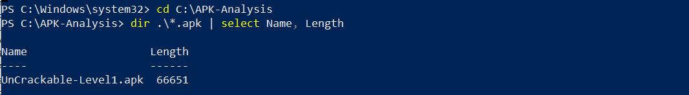

### ZIP Header Verification
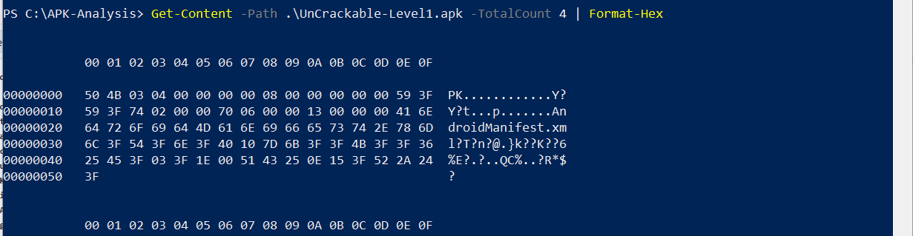

### APK File Structure
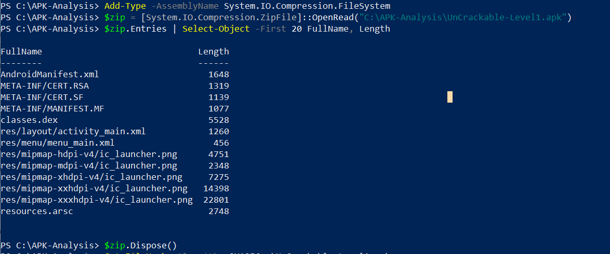

### SHA256 Hash
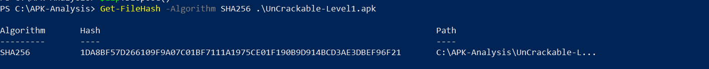

### APK Signature
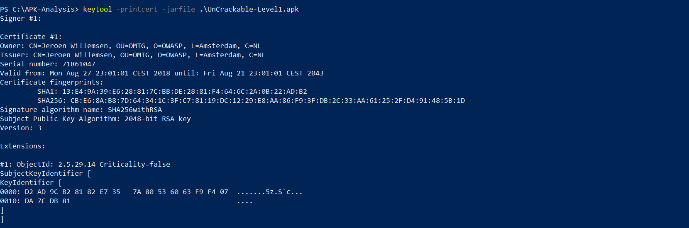
## Task 3 — Analyse du manifeste (JADX)

### Informations extraites
- **Package :** `owasp.mstg.uncrackable1`
- **Version :** 1.0 (versionCode = 1)
- **minSdkVersion :** 19
- **targetSdkVersion :** 28

### Permissions demandées
- Aucune permission déclarée dans le manifest.

### Composants identifiés
- **Activity principale :** `sg.vantagepoint.uncrackable1.MainActivity` (MAIN/LAUNCHER)

### Composants exportés / exposition
- Aucun attribut `android:exported` n'est défini dans le manifest.
- L’activité principale contient un `intent-filter` MAIN/LAUNCHER (exposition attendue pour lancer l’application).

### Configurations sensibles
- `android:debuggable="true"` : absent
- `android:usesCleartextTraffic="true"` : absent
- `android:allowBackup="true"` : **présent** (à vérifier selon les données stockées)

### Captures
- 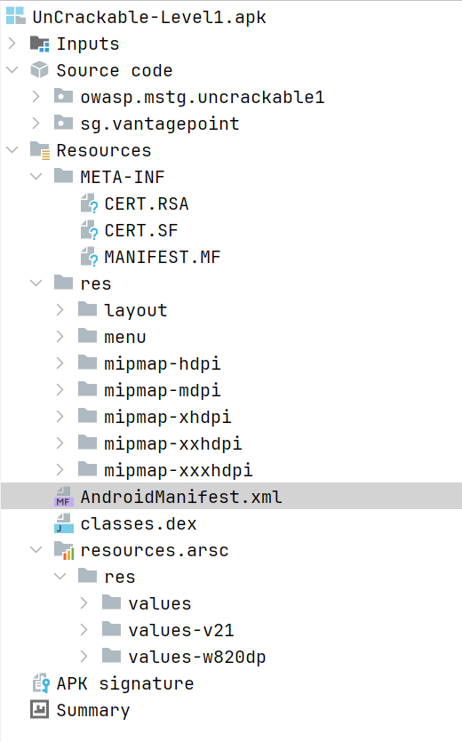
- 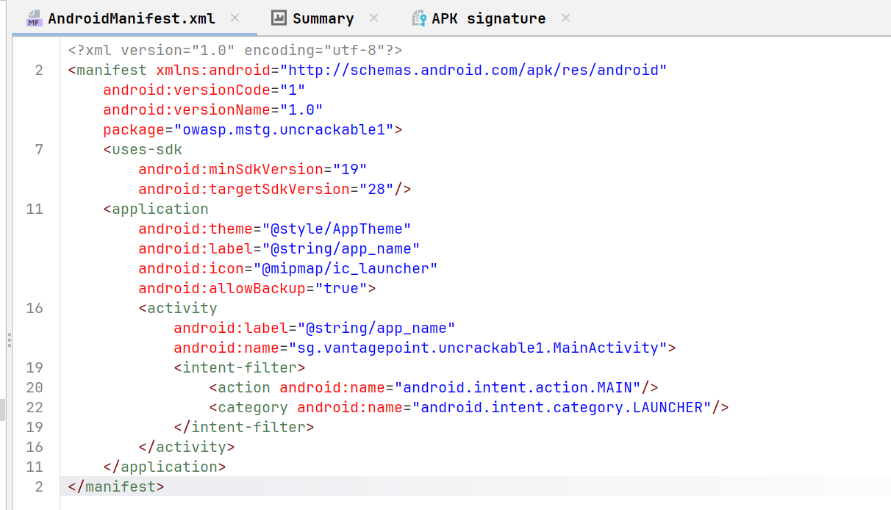

## Task 4 — Recherche de chaînes sensibles (JADX)

### Résultats principaux (observations)

1. **`http` — RAS (faible)**
   - Résultat : uniquement `http://schemas.android.com/apk/res/android` (namespace Android XML)
   - Interprétation : ce n’est pas un endpoint réseau.
   - **Risque : Faible**
   - Preuve : 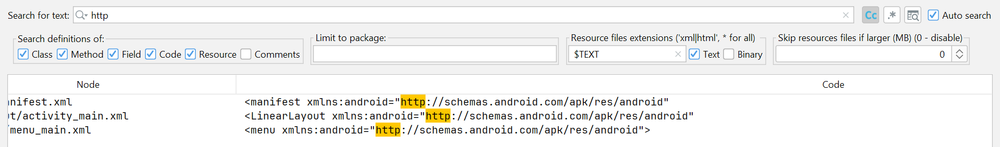

2. **Texte UI lié au “secret” (faible)**
   - Résultat : `res/values/strings.xml` → `"Enter the Secret String"`
   - Interprétation : texte d’interface, non sensible.
   - **Risque : Faible**
   **Crypto potentiellement faible : AES/ECB (moyen)**
   - Référence à `SecretKeySpec` et à l’algorithme `"AES/ECB/PKCS7Padding"`
   - Localisation : `sg.vantagepoint.a.a` → `a(byte[] bArr, byte[] bArr2)`
   - Interprétation : ECB est une mauvaise pratique cryptographique (absence d’IV, motifs détectables).
   - **Risque : Moyen**
   - **Remédiation :** préférer AES-GCM ou AES-CBC avec IV aléatoire + authentification.
   **Chaîne en clair liée à la validation du “secret” (moyen)**
   - Résultat : `"This is the correct secret."`
   - Localisation : `sg.vantagepoint.uncrackable1.MainActivity` (méthode `verify(...)` ou code associé)
   - Interprétation : logique/secret potentiellement exposé en clair dans le code.
   - **Risque : Moyen**
   - **Remédiation :** éviter les secrets en dur ; déplacer côté serveur/Keystore selon besoin.
   - Preuve : 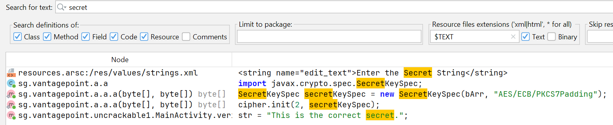

3. **Indicateur debug en clair (faible)**
   - Résultat : `"App is debuggable!"`
   - Localisation : `sg.vantagepoint.uncrackable1.MainActivity#onCreate(Bundle)`
   - Interprétation : message explicite lié à un contrôle anti-debug côté client.
   - **Risque : Faible**
   - **Remédiation :** retirer/limiter les messages debug explicites en production.
   - Preuve : 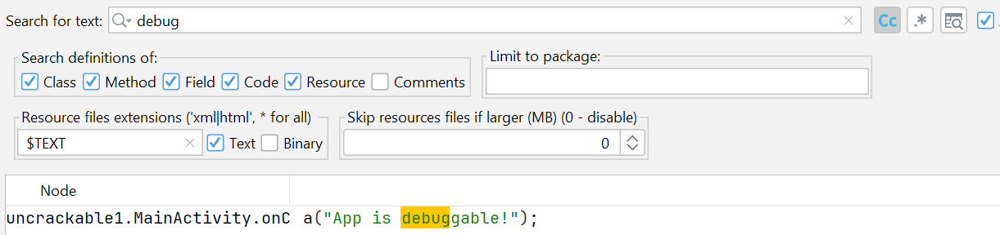
4. **Détection de build “test-keys” (faible à moyen)**
   - Résultat : `str.contains("test-keys")`
   - Interprétation : check d’environnement/dev build tags.
   - **Risque : Faible à Moyen**
   - **Remédiation :** éviter les checks fragiles côté client, renforcer le pipeline de build/CI et contrôles adaptés au contexte.
   - Preuve : 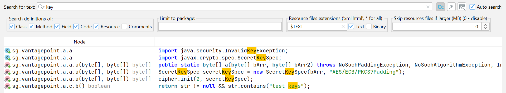

5. **Indices de détection root (faible à moyen)**
   - Résultats : chemins/strings type `/dev/...superuser...` et références `su_daemon`
   - Interprétation : signatures de détection root/environnement.
   - **Risque : Faible à Moyen**
   - **Remédiation :** limiter les messages explicites, compléter par mécanismes adaptés (selon contexte).
   - Preuve : 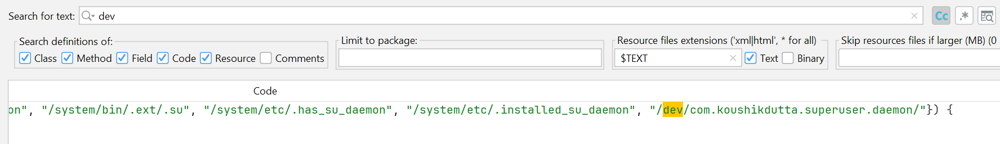

### Preuves “RAS” (0 résultats)
- `https` : 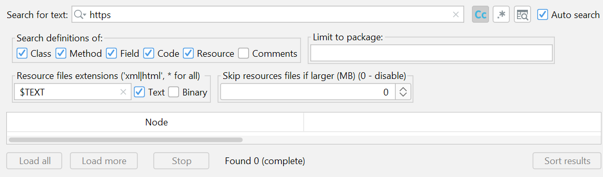
- `password` : 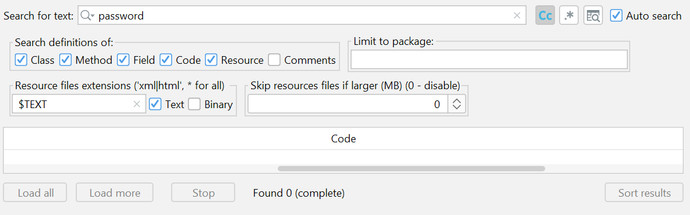
- `token` : 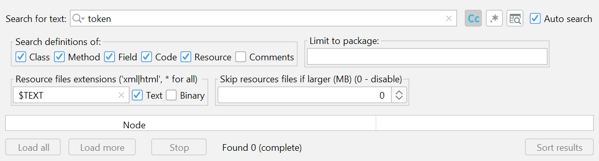
- `api_key` : 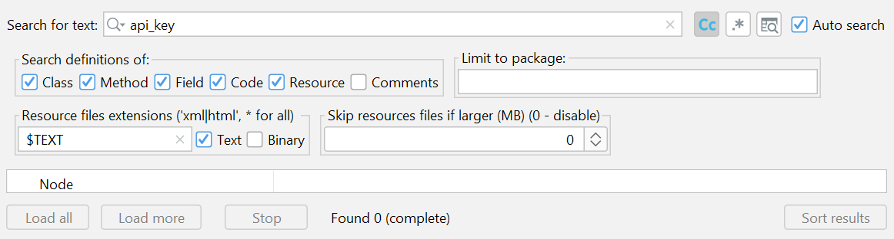
- `staging` : 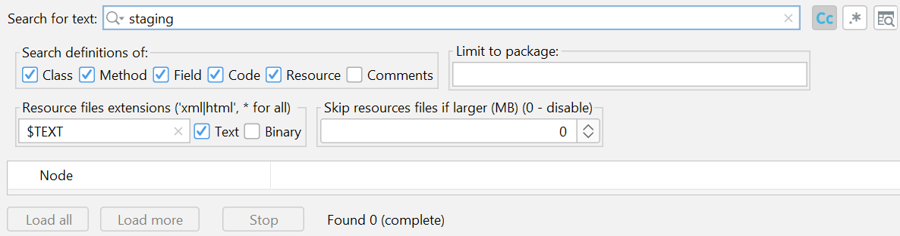
- `firebase` : 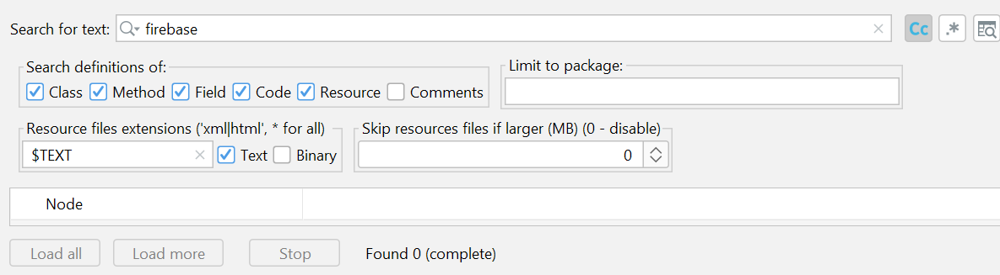

### Preuves (contexte code)
- Crypto (AES/ECB) : 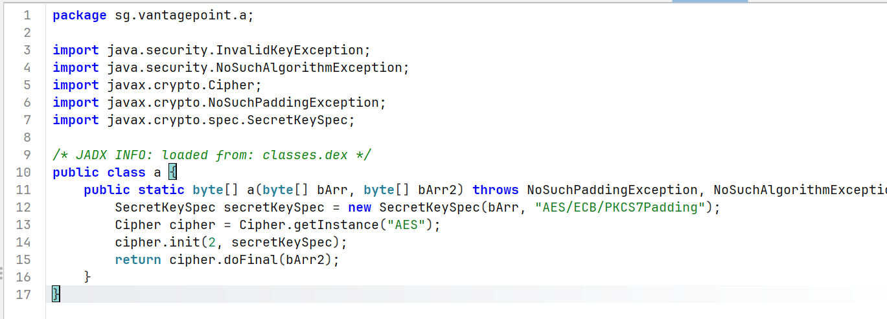
- MainActivity (root/debug checks) : 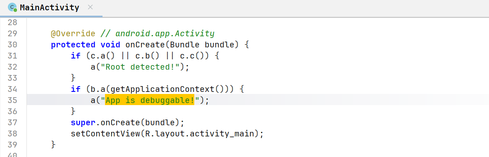

  ## Task 5 — Conversion DEX → JAR (dex2jar)

### Installation
dex2jar (version 2.x) téléchargé depuis le dépôt officiel GitHub et installé dans `C:\Tools\dex-tools-2.x`.

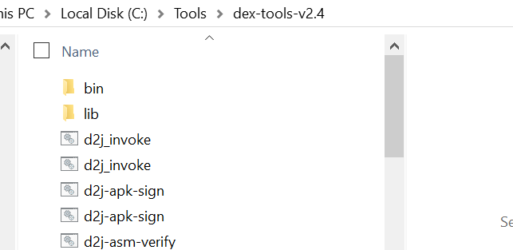

### Extraction des fichiers DEX
Extraction de `classes.dex` depuis l’APK.

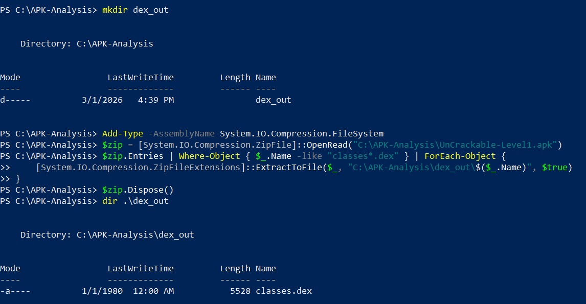

### Conversion DEX → JAR
Conversion réalisée avec `d2j-dex2jar.bat`.

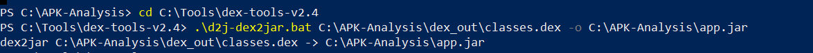

### Vérification du fichier JAR
Le fichier `app.jar` a été généré avec succès.

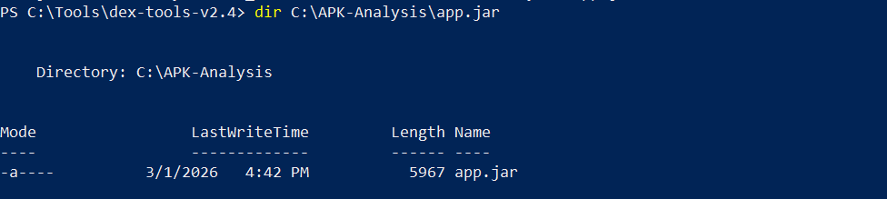

## Task 6 — Comparaison JADX vs JD-GUI

### Chargement dans JD-GUI
- Ouverture de `app.jar` généré par dex2jar dans JD-GUI.

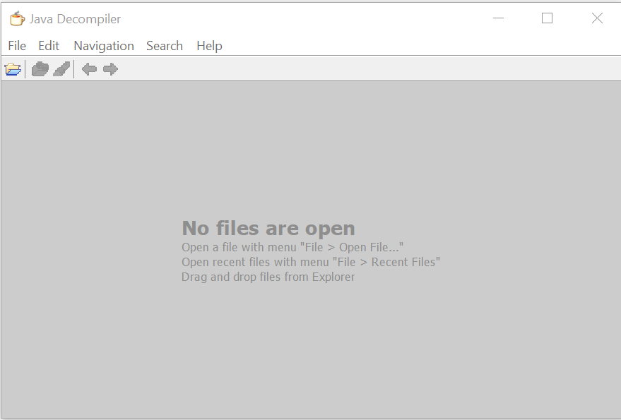
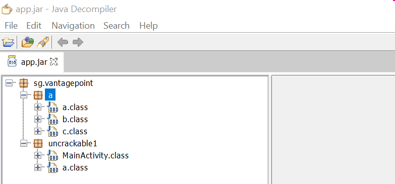

### Classe comparée
Classe analysée dans les deux outils : `sg.vantagepoint.uncrackable1.MainActivity`

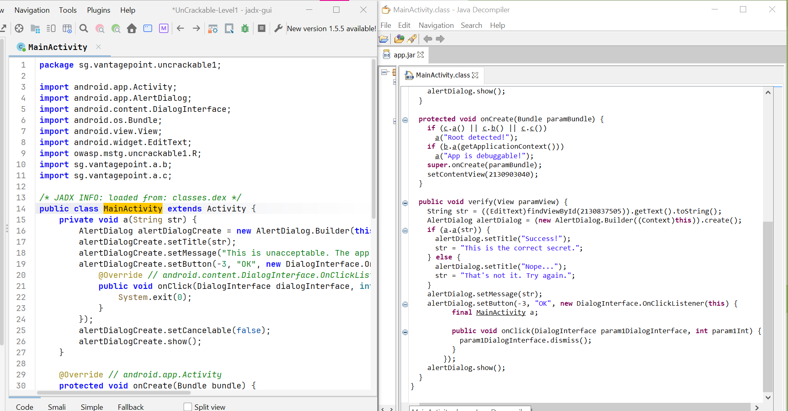

### Différences notables (≥3)

1. **Gestion des ressources Android (R)**
   - JADX reconstruit correctement `R.layout` et `R.id` :
     - `setContentView(R.layout.activity_main)`
     - `findViewById(R.id.edit_text)`
   - JD-GUI affiche des IDs numériques :
     - `setContentView(2130903040)`
     - `findViewById(2130837505)`

2. **Contexte Android et style du code**
   - JADX produit un code plus “Android-friendly” (`new AlertDialog.Builder(this)`, `@Override` lisible).
   - JD-GUI ajoute souvent des casts explicites (`(Context)this`) et un style plus verbeux.

3. **Lisibilité / reconstruction**
   - JADX offre une lecture plus claire (structure, variables, références Android).
   - JD-GUI ressemble davantage à une reconstruction “bytecode Java”, avec variables génériques (`paramView`, `paramBundle`) et classes internes plus lourdes.

### Conclusion
Pour l’analyse statique d’un APK Android (manifest + ressources + code), **JADX** est plus adapté. **JD-GUI** reste utile comme vue alternative Java, notamment pour comparer la décompilation.


# Contournement de la Détection Root (Frida)

## Objectif

Contourner le mécanisme de détection root implémenté dans OWASP UnCrackable Level 1 en utilisant l’instrumentation dynamique avec Frida, sans modifier l’APK.


---

## Détection Root Observée

Lors du lancement de l’application sur un émulateur rooté, la fenêtre suivante apparaît :

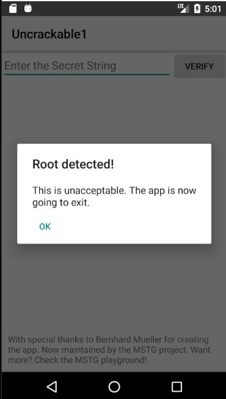

L’application se ferme immédiatement après la détection.

---

## Code de Détection Root 

La détection root est déclenchée dans :

sg.vantagepoint.uncrackable1.MainActivity#onCreate()

```java
if (c.a() || c.b() || c.c()) {
    a("Root detected!");
}
```

La logique de détection est implémentée dans :

sg.vantagepoint.a.c

Vérifications effectuées :

c.a() → Recherche du binaire su dans le PATH  
c.b() → Vérifie si Build.TAGS contient "test-keys"  
c.c() → Recherche d’artefacts root connus  

---

##  Installation de Frida (Machine Windows)

Installation des outils Frida via pip :

```bash
pip install frida-tools
```

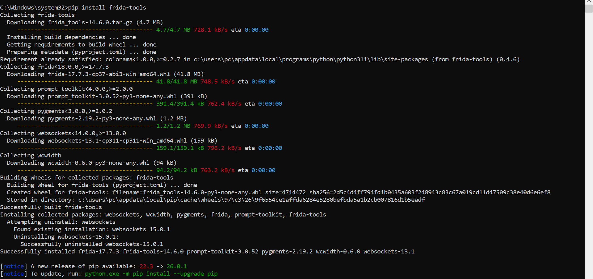

---

##  Déploiement du Serveur Frida (Émulateur)

Fichier téléchargé :
https://github.com/frida/frida/releases?page=9
frida-server-16.3.3-android-x86_64.xz

Extraction et renommage en :

frida-server

Envoi vers l’émulateur :

```bash
adb root
adb push frida-server /data/local/tmp/
adb shell chmod 755 /data/local/tmp/frida-server
```

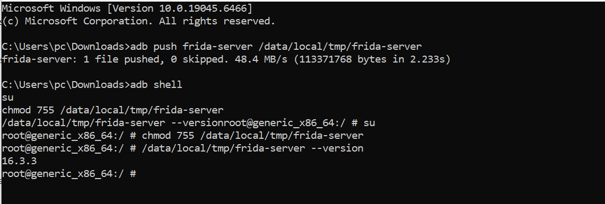

Exécution du serveur Frida :

```bash
adb shell
su
/data/local/tmp/frida-server &
```

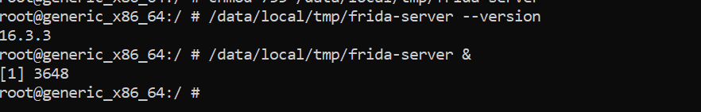

Vérification de la connexion :

```bash
frida-ps -U
```

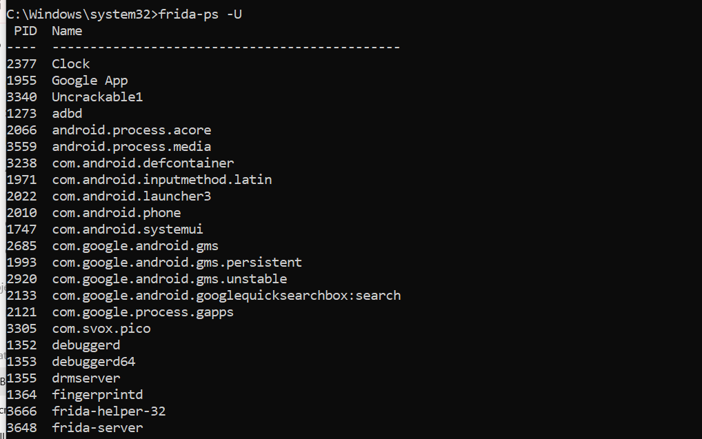

Émulateur détecté avec succès.

---

##  Script de Contournement

Fichier créé :

bypass.js

Contenu du script :

```javascript
Java.perform(function () {

    var rootClass = Java.use("sg.vantagepoint.a.c");

    rootClass.a.implementation = function () {
        console.log("Contournement c.a()");
        return false;
    };

    rootClass.b.implementation = function () {
        console.log("Contournement c.b()");
        return false;
    };

    rootClass.c.implementation = function () {
        console.log("Contournement c.c()");
        return false;
    };

});
```

---

## Exécution du Contournement

Lancement de l’application via Frida :

```bash
frida -U -f owasp.mstg.uncrackable1 -l bypass.js
```

Sortie console confirmant les hooks :


```
Contournement c.a()
Contournement c.b()
Contournement c.c()
```

---

## Résultat Après Contournement

L’application se lance désormais normalement sans afficher "Root detected!".

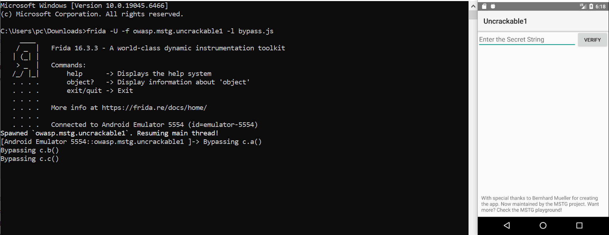

La détection root a été neutralisée dynamiquement à l’exécution.

---

##  Interprétation Sécurité

Cette expérience démontre :

La détection root est implémentée uniquement côté client  

Les vérifications statiques sont facilement contournables via instrumentation dynamique  

Les contrôles de sécurité côté client seuls sont insuffisants  

---

##  Évaluation du Risque

| Mécanisme de protection | Robustesse | Difficulté de contournement |
|--------------------------|------------|-----------------------------|
| Détection du binaire su | Faible     | Facile                      |
| Vérification Build.TAGS | Faible     | Facile                      |
| Recherche de fichiers   | Faible     | Facile                      |

Niveau global de protection dynamique : Faible

---

##  Conclusion

À l’aide de Frida, nous avons contourné avec succès tous les mécanismes de détection root dynamiquement sans modifier l’APK.

Cela confirme :

Les protections côté client ne sont pas fiables face à la manipulation à l’exécution  

La logique sensible ne doit pas reposer uniquement sur des vérifications d’environnement  

Des protections renforcées (anti-hooking, vérification d’intégrité, validation serveur) sont nécessaires pour des applications en production  

# Crack — Récupération du secret par analyse statique


Cette analyse démontre qu’il est possible de récupérer le secret de l’application par simple analyse statique du code APK, sans instrumentation dynamique.

Le secret a pu être récupéré par analyse statique, démontrant la faiblesse du mécanisme de validation côté client.

---

## Analyse de la fonction de validation

Dans `MainActivity`, la vérification repose sur l’instruction suivante :

```java
if (a.a(string)) {
```

En utilisant la fonctionnalité "Go to declaration" dans JADX, nous accédons à la classe :

sg.vantagepoint.uncrackable1.a

et à la méthode :

```java
public static boolean a(String str)
```

Cette méthode :

Convertit une clé hexadécimale en bytes :  
8d127684cbc37c17616d806cf50473cc

Décode un ciphertext Base64 :  
5UJiFctbmgbDoLXmpL12mkno8HT4Lv8dlat8FxR2GOc=

Effectue un déchiffrement AES via :  
sg.vantagepoint.a.a.a(...)

Compare le résultat du déchiffrement avec l’entrée utilisateur :

```java
return str.equals(new String(bArrA));
```
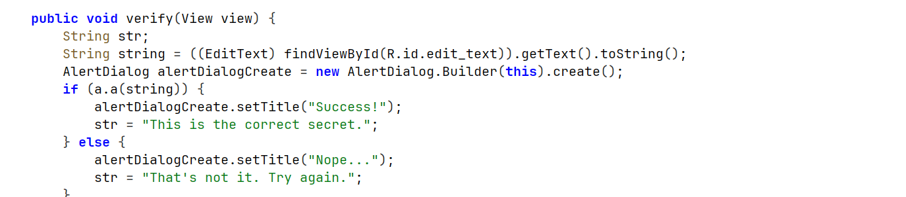
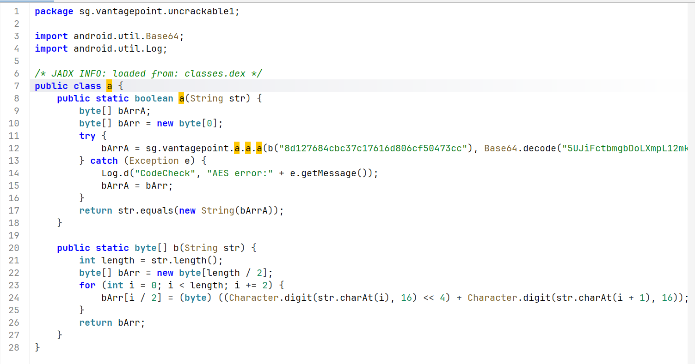

---

## Analyse cryptographique

La méthode appelée (sg.vantagepoint.a.a.a) utilise :

Algorithme : AES  
Mode : ECB  
Padding : PKCS7  
Taille de clé : 128 bits  

ECB étant un mode déterministe sans IV, le chiffrement peut être reproduit statiquement.

---

## Déchiffrement manuel

En reproduisant le déchiffrement AES-ECB à l’aide de CyberChef :

Clé (HEX) :  
8d127684cbc37c17616d806cf50473cc  

Ciphertext (Base64) :  
5UJiFctbmgbDoLXmpL12mkno8HT4Lv8dlat8FxR2GOc=

Le texte en clair obtenu est :

I want to believe

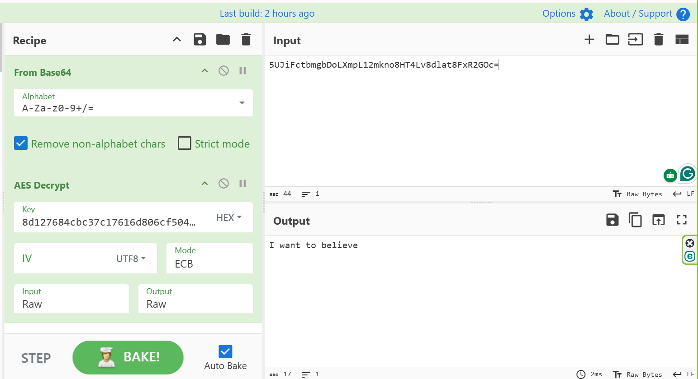

---

## Validation dans l’émulateur

Après saisie du secret récupéré dans l’application :

L’application affiche :

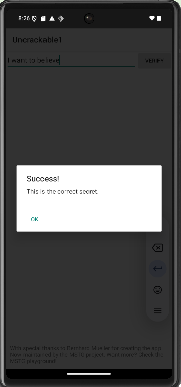

---

## Conclusion du crack

Le secret est entièrement stocké et validé côté client.  
Il peut être récupéré par simple analyse statique sans instrumentation dynamique.

Cela démontre :

La faiblesse du stockage de secrets côté client  

L’insuffisance d’une protection basée uniquement sur le chiffrement local  

L’utilisation d’un mode cryptographique faible (AES/ECB)  

L’absence de vérification côté serveur  


## Task 8 — Nettoyage et conformité

- Vérification effectuée : aucune donnée sensible réelle (token, mot de passe, clé API) présente dans le rapport.
- Les artefacts d'analyse ont été organisés.
- Environnement conforme aux règles pédagogiques.
- Organisation des fichiers
  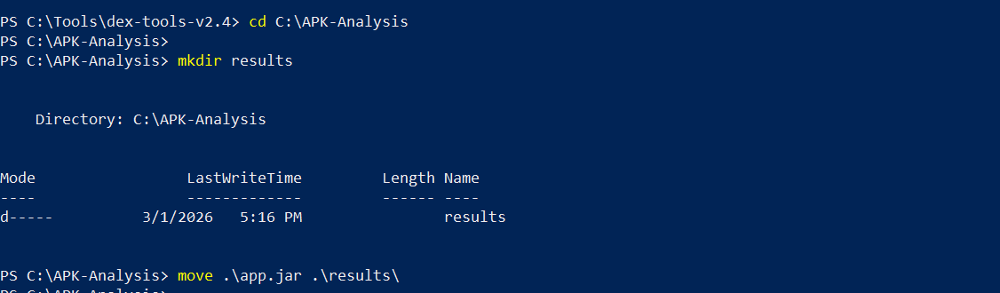
  ### Nettoyage des artefacts temporaires

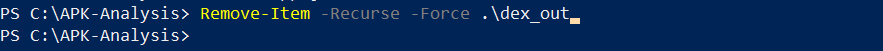


## Résumé exécutif

Cette analyse statique de l’application **OWASP UnCrackable Level 1** a permis d’identifier plusieurs points de sécurité pertinents.

Les principales observations concernent :

1. L’utilisation d’un schéma cryptographique faible (AES en mode ECB).
2. La présence d’une chaîne sensible en clair dans le code (`"This is the correct secret."`).
3. Des mécanismes de détection root/debug implémentés uniquement côté client.

Aucune permission dangereuse, aucun token, ni clé API de production n’ont été identifiés.  
Cependant, les pratiques cryptographiques et l’exposition de logique sensible justifient une vigilance particulière.
Le secret a pu être récupéré par analyse statique, démontrant la faiblesse du mécanisme de protection côté client.

### Niveau de risque global : **Moyen**

Des améliorations sont recommandées, notamment :
- Remplacement d’AES/ECB par AES-GCM ou AES-CBC avec IV sécurisé.
- Éviter les secrets en dur dans le code.
- Limiter les messages explicites liés aux contrôles de sécurité.

## Constats détaillés

### Constat #1 : Sauvegarde Android autorisée (allowBackup=true)
**Sévérité :** Faible à Moyenne  
**Description :** L’application autorise la sauvegarde Android via `android:allowBackup="true"`.  
**Localisation :** `AndroidManifest.xml`  
**Impact potentiel :** Si des données sensibles sont stockées localement, elles pourraient être incluses dans des sauvegardes système.  
**Remédiation recommandée :** Désactiver la sauvegarde (`android:allowBackup="false"`) ou sécuriser les données sensibles.

---

### Constat #2 : Utilisation d’un schéma cryptographique faible (AES/ECB)
**Sévérité :** Moyenne  
**Description :** Le code utilise `"AES/ECB/PKCS7Padding"`, un mode cryptographique considéré faible.  
**Localisation :** `sg.vantagepoint.a.a` → méthode `a(byte[] bArr, byte[] bArr2)`  
**Impact potentiel :** Le mode ECB ne protège pas contre l’analyse de motifs dans les données chiffrées.  
**Remédiation recommandée :** Utiliser AES-GCM ou AES-CBC avec IV aléatoire et authentification.

---

### Constat #3 : Présence d’une chaîne sensible en clair
**Sévérité :** Moyenne  
**Description :** La chaîne `"This is the correct secret."` est présente en clair dans le code.  
**Localisation :** `sg.vantagepoint.uncrackable1.MainActivity#verify(View)`  
**Impact potentiel :** Exposition de logique sensible directement dans le code client.  
**Remédiation recommandée :** Éviter les secrets en dur ; déplacer la logique sensible côté serveur si applicable.

---

### Constat #4 : Messages explicites liés au debug
**Sévérité :** Faible  
**Description :** L’application affiche le message `"App is debuggable!"` en cas de détection.  
**Localisation :** `MainActivity#onCreate(Bundle)`  
**Impact potentiel :** Les messages explicites peuvent révéler les mécanismes de protection.  
**Remédiation recommandée :** Limiter les messages debug en production.

---

### Constat #5 : Détection d’environnement (root / test-keys) côté client
**Sévérité :** Faible à Moyenne  
**Description :** Le code contient des vérifications de root et de build tags (`test-keys`).  
**Localisation :** `MainActivity#onCreate(Bundle)` et classes associées  
**Impact potentiel :** Les contrôles côté client peuvent être contournés.  
**Remédiation recommandée :** Compléter par des mécanismes adaptés selon le contexte (attestation, validation serveur).

---


## Annexes

### Permissions demandées
- Aucune permission déclarée

### Composants exposés
- MainActivity (MAIN/LAUNCHER)

  ## Questions guidées (Bonus)

### 1. Quelles permissions demandées par l'application vous semblent excessives par rapport à sa fonction principale ?

L’application **ne demande aucune permission** dans son `AndroidManifest.xml`.  
Aucune permission excessive n’a été identifiée.  
Cela réduit significativement la surface d’attaque liée aux permissions Android.

---

### 2. Identifiez un composant exporté et expliquez comment il pourrait être exploité par une application malveillante.

La `MainActivity` est exposée via un `intent-filter` avec :

- `android.intent.action.MAIN`
- `android.intent.category.LAUNCHER`

Cela est normal pour permettre le lancement de l’application.  
Cependant, dans un autre contexte, un composant exporté pourrait être exploité si :

- Il accepte des données via `Intent`
- Il ne valide pas correctement les entrées
- Il expose des fonctionnalités sensibles

Dans ce cas précis, aucune exploitation directe n’a été identifiée.

---

### 3. Si vous trouvez une URL en clair dans le code, comment recommanderiez-vous de la sécuriser ?

Si une URL en clair était trouvée :

- Utiliser exclusivement **HTTPS**
- Activer la validation stricte des certificats
- Éviter le `usesCleartextTraffic="true"`
- Implémenter le **certificate pinning**
- Déplacer la logique sensible côté serveur si possible

---

### 4. Comment l'obfuscation du code complique-t-elle l'analyse statique ? Quelles parties restent généralement non obfusquées ?

L’obfuscation (ProGuard/R8) :

- Renomme les classes et méthodes (`a`, `b`, `c`)
- Supprime certains métadonnées
- Rend la lecture moins intuitive

Cependant, certaines parties restent généralement non obfusquées :

- `AndroidManifest.xml`
- Ressources (`res/`)
- Identifiants `R`
- Certaines bibliothèques publiques

Cela permet tout de même une analyse partielle.

---

### 5. Comparez les risques entre une application qui stocke un token dans les SharedPreferences et une qui le stocke dans une variable en mémoire.

- **SharedPreferences :**
  - Stockage persistant
  - Risque plus élevé si appareil compromis
  - Peut être extrait via sauvegarde si `allowBackup=true`

- **Variable en mémoire :**
  - Stockage temporaire
  - Disparaît à la fermeture de l’application
  - Risque plus faible

Conclusion : le stockage persistant présente un risque supérieur.

---

### 6. Si vous trouvez `android:allowBackup="true"` dans le manifeste, quel est le risque associé et comment le corriger ?

**Risque :**
Les données de l’application peuvent être incluses dans les sauvegardes système Android.

**Correction :**
Définir :
android:allowBackup="false"
Ou chiffrer les données sensibles avant stockage.

---


### 7. Quelle est la différence de risque entre un composant avec `exported="true"` explicite et un avec un `intent-filter` sans attribut `exported` ?

Avant Android 12 (API < 31) :

- Un composant possédant un `intent-filter` pouvait être implicitement exporté, même sans attribut `android:exported`.
- Cela pouvait exposer involontairement le composant à d'autres applications.

Depuis Android 12 :

- L’attribut `android:exported` doit être explicitement défini pour tout composant ayant un `intent-filter`.
- Cela réduit les expositions accidentelles.

**Différence de risque :**

- `exported="true"` explicite :  
  Le développeur indique volontairement que le composant est accessible par d’autres applications.  
  Le risque dépend alors de la validation des entrées et des contrôles de sécurité implémentés.

- `intent-filter` sans `exported` (avant Android 12) :  
  Risque plus élevé d’exposition involontaire, car le composant pouvait être accessible sans que le développeur en ait pleinement conscience.

Dans tous les cas, un composant exporté augmente la surface d’attaque s’il manipule des données sensibles sans validation stricte.

---

### 8. Comment évalueriez-vous la sécurité d'une application qui utilise `WebView.setJavaScriptEnabled(true)` ?

L’activation de JavaScript dans une WebView augmente significativement la surface d’attaque.

**Risques potentiels :**

- Exécution de scripts malveillants si du contenu non fiable est chargé
- Exploitation via XSS si les entrées ne sont pas contrôlées
- Risque critique si combiné avec `addJavascriptInterface()` (exposition d’objets Java au JavaScript)

**Évaluation de sécurité :**

- Vérifier si JavaScript est réellement nécessaire
- Vérifier l’origine des URL chargées
- Empêcher le chargement de contenu non fiable
- Implémenter des contrôles supplémentaires côté serveur

**Bonne pratique :**
Désactiver JavaScript si inutile et limiter strictement les sources de contenu chargées dans la WebView.
